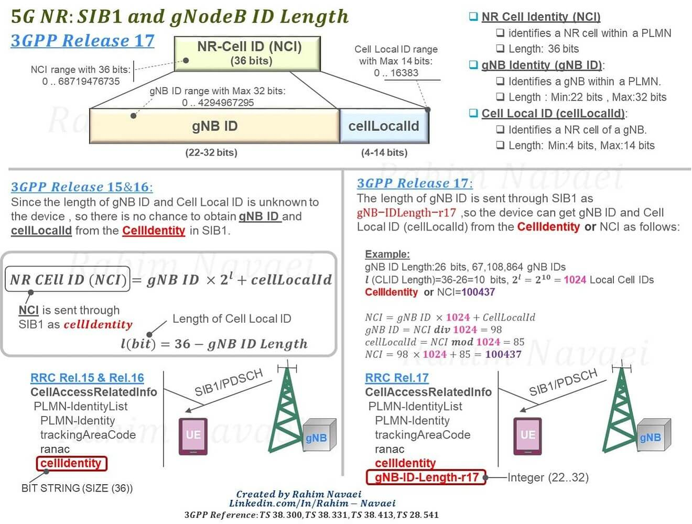
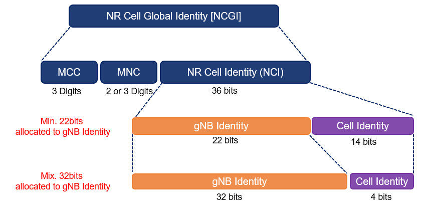

<figure>
    
    <figcaption>5G NR: SIB1 and gNodeB Identity (gNB ID) Length</figcaption>
</figure>

<figure>
    
    <figcaption>NR Cell Global Identity and NR Cell Identity Structure</figcaption>
</figure>