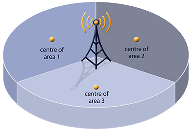
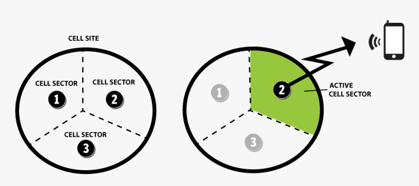
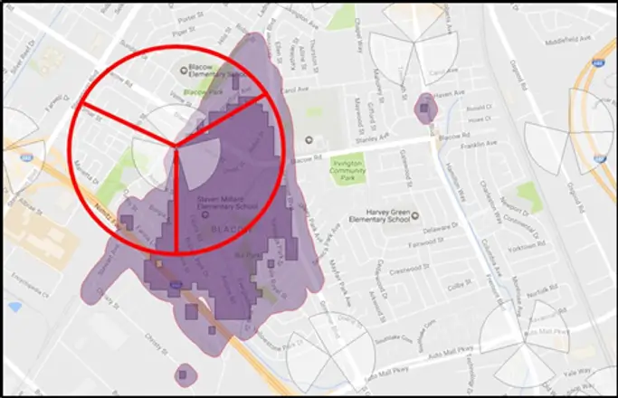
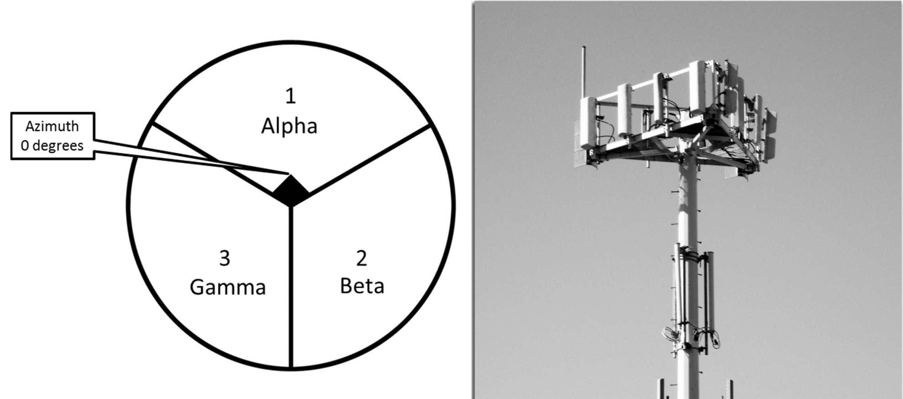
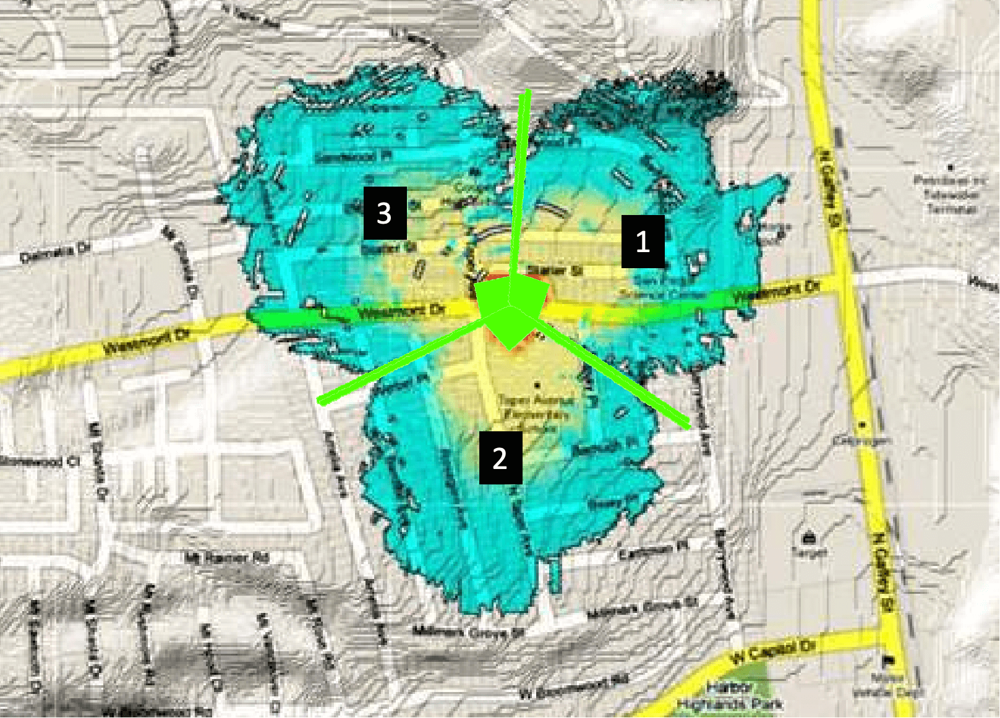

## Open databases of cell towers

- [Mozilla Location Service (MLS)](https://location.services.mozilla.com/)
- [OpenCellid](https://opencellid.org/)

## Cell towers and cells are two different things

It is very rare that only one antenna emitting a 360-degree GSM signal is mounted on a physical cell tower. More often, several antennas are mounted on a cell tower, many of them having 3 or 4 per network access type (GPRS, UMTS, LTE...).
In this case, each antenna serves one segment of the full 360 degrees circle. A sample cell tower, with each antennae emitting signals at 120 degrees, is shown here:

<figure>
    
    <figcaption>Cell tower with 3 cells, each with 120° angle</figcaption>
</figure>

Imagine that many cell ID measurements have been collected, equally distributed in one of the pie slices. In this case, the average of all recorded GPS positions would be as indicated in the graph above (e.g. "centre of area 1"). This would then be the position reported by the service.

<figure>
    
    <figcaption>Active cell sector</figcaption>
</figure>

<figure>
    
    <figcaption>Actual cell sector coverage</figcaption>
</figure>

Sector Number — Typical antenna pointing direction:

1. — approximately N to NE;
2. — 120° clockwise from 1 --- approximately SE to S;
3. — 120° clockwise from 2 --- approximately W.

Omni-directional antennas — which are rare — may be assigned sector number 0.

Cell towers can have from 0 to 6 sectors.
Most common is three sectors.

<figure>
    
    <figcaption>Sector layout and azimuth</figcaption>
</figure>

<figure>
    
    <figcaption>Example of expected 3 sector cell tower radio coverage</figcaption>
</figure>
